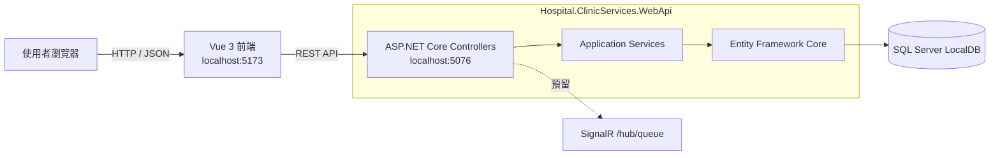

# Hospital.ClinicServices 預約掛號系統

以 ASP.NET Core Web API、Entity Framework Core 與 Vue 3 建立的預約掛號 MVP。使用者可以依科別查詢本週或下週門診、選擇醫師與時段，並以初診或複診身分完成掛號；後端另提供醫師叫號 API。

## MVP 功能

- 查詢科別與門診排班
- 依週次、上午／下午／晚上篩選門診
- 初診建立病患資料並掛號
- 複診以身分證字號與生日掛號
- 顯示掛號序號與掛號結果
- 醫師呼叫下一號
- 開發環境自動建立示範醫師、病患、排班與掛號資料

## 技術架構

| 層級 | 技術 |
| --- | --- |
| 前端 | Vue 3、TypeScript、Pinia、Vue Router、Vite |
| 後端 | ASP.NET Core Web API、C#、Swagger、SignalR |
| 資料存取 | Entity Framework Core 10 |
| 資料庫 | SQL Server LocalDB |
| 測試 | xUnit、SQLite in-memory、Vitest |



主要資料關係：`Department` 擁有醫師與排班，`Schedule` 對應一位醫師及看診時段，`Appointment` 連結排班與病患。

## 專案結構

```text
Hospital.ClinicServices.Web/           Vue 前端
Hospital.ClinicServices.WebApi/        ASP.NET Core API、EF Core Migration
Hospital.ClinicServices.WebApi.Tests/  後端服務與資料庫整合測試
Hospital.ClinicServices.slnx           .NET solution
```

## 本機啟動

### 環境需求

- .NET 10 SDK
- SQL Server Express LocalDB
- Node.js 22.18 以上（或 24.12 以上）
- npm

### 1. 建立資料庫

連線字串預設使用 `(localdb)\MSSQLLocalDB`。在專案根目錄執行：

```powershell
dotnet tool install --global dotnet-ef
dotnet ef database update --project Hospital.ClinicServices.WebApi
```

若已安裝 `dotnet-ef`，只需執行第二行。API 第一次以 Development 環境啟動時，會自動加入 demo 資料。

### 2. 啟動後端

```powershell
dotnet run --project Hospital.ClinicServices.WebApi --launch-profile http
```

- API：<http://localhost:5076>
- Swagger：<http://localhost:5076/swagger>

### 3. 啟動前端

另開一個終端機：

```powershell
Copy-Item Hospital.ClinicServices.Web/.env.example Hospital.ClinicServices.Web/.env
Set-Location Hospital.ClinicServices.Web
npm install
npm run dev
```

開啟 <http://localhost:5173>。

## Demo 步驟

### 民眾初診掛號

1. 進入首頁，確認畫面顯示科別清單。
2. 點選任一科別，進入門診排班。
3. 切換「本週／下週」或診別，展示排班篩選。
4. 點選一位醫師的門診，進入預約掛號。
5. 選擇「初診」，輸入未使用過的有效格式資料，例如身分證字號 `A123456789`、姓名、`09` 開頭的十碼手機與生日。
6. 送出後確認畫面顯示「掛號成功」、看診號碼與掛號編號。

若重複使用相同病患及排班，可展示系統拒絕重複掛號的業務規則。因 demo 排班由程式隨機建立，實際科別與醫師每個資料庫可能不同。

### Swagger 展示叫號

1. 開啟 <http://localhost:5076/swagger>。
2. 展開 `POST /api/doctor/{scheduleId}/next`。
3. 輸入剛才掛號使用的排班編號並執行。
4. 確認回應中的 `currentCallingNumber` 遞增。

## 測試與建置

```powershell
dotnet test Hospital.ClinicServices.slnx
npm --prefix Hospital.ClinicServices.Web run build
```

目前有 22 個後端測試，使用 SQLite in-memory 驗證服務與資料庫行為，不會修改本機開發資料庫。前端已設定 Vitest，但尚未加入測試案例。

## API 摘要

| Method | Endpoint | 用途 |
| --- | --- | --- |
| GET | `/api/department` | 取得科別 |
| GET | `/api/schedule/{departmentId}` | 依科別、週次及診別取得排班 |
| POST | `/api/appointment/register-first-visit` | 初診建檔並掛號 |
| POST | `/api/appointment/register` | 複診掛號 |
| POST | `/api/doctor/{scheduleId}/next` | 呼叫下一號 |

更細的開發說明請參考 [後端 README](Hospital.ClinicServices.WebApi/README.md) 與 [前端 README](Hospital.ClinicServices.Web/README.md)。
